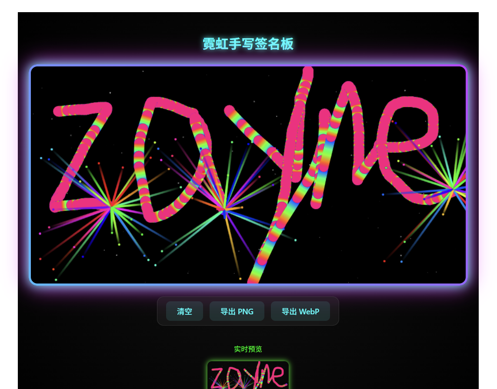

# Neon Canvas Signature

基于 Vue3 + Canvas2D 的霓虹手写签名板  
彩虹压感笔迹 | 粒子爆炸 | WebP 压缩 75% | 高清屏适配  

## 🚀 在线体验

[](https://rainseason-hash.github.io/canvas--/)

**直接访问**: [https://rainseason-hash.github.io/canvas--/](https://rainseason-hash.github.io/canvas--/)

## 📸 效果展示

  


## 💡 技术亮点

- 🎨 Canvas 2D 路径绘制、压感粗细、彩虹渐变  
- ✨ 粒子爆炸动画（RAF 60 FPS）  
- 📱 devicePixelRatio 高清屏适配  
- 💾 WebP 导出压缩，体积减少 75%  
- 🎭 纯 CSS 霓虹脉冲、毛玻璃、光波按钮  

## 🛠️ 快速开始

```bash
# 克隆项目
git clone https://github.com/Rainseason-hash/canvas--.git

# 安装依赖
npm install

# 启动开发
npm run dev
